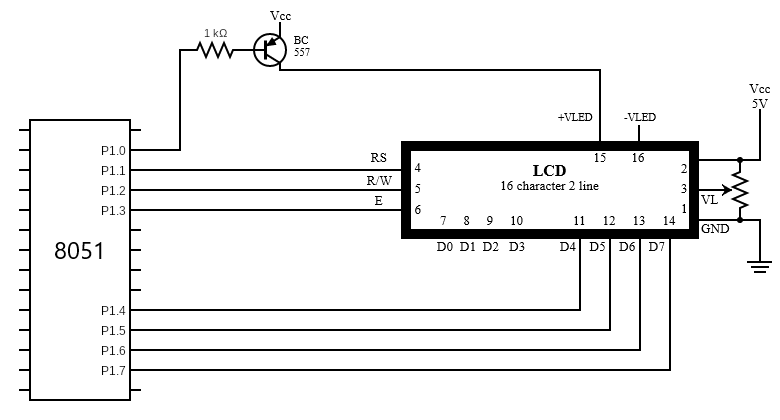
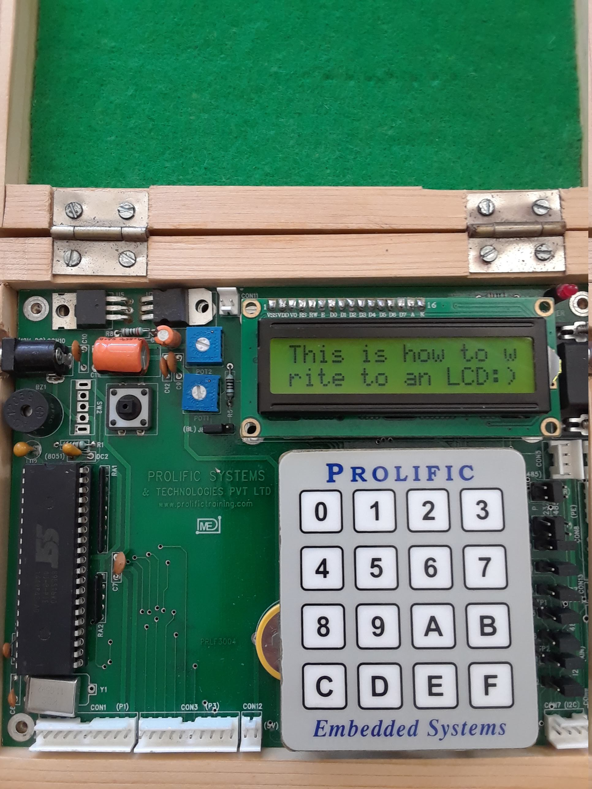

# lcd
Writes values to LCD

## Getting Started

### Requirements
* Keil IDE
* Flash Magic
* 8051 microcontroller
* Hitachi HD44780 LCD

### Installing
1. Connect LCD to the 8051 microcontroller as shown in the following diagram:
   
1. Open Keil and create new project
   * Choose Philips P89V51RD2 database
1. Add lcd.c file to Source Group
   * Edit string variable on line 27 of lcd.c: string[] = "XXXXXXXX"
   * string should be 32 characters or less
1. Build target
1. Use Flash Magic to write the resulting hex file to the 8051 microcontroller

### Example

We can display the string "This is how to write to an LCD:)" by saving it to the string variable on line 27.
  After saving to the variable, we build the target, and use Flash Magic to write the hex file to the microcontroller.

## Authors

* **Sahil Mahajan**

## License

This project intentionally has no license.
